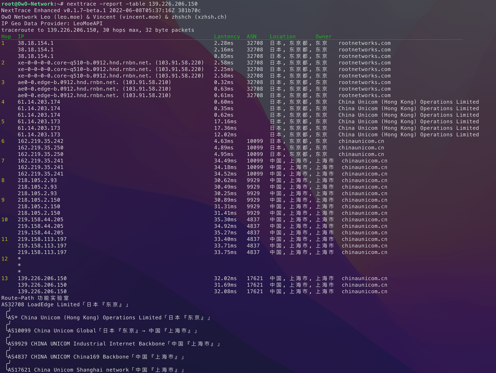
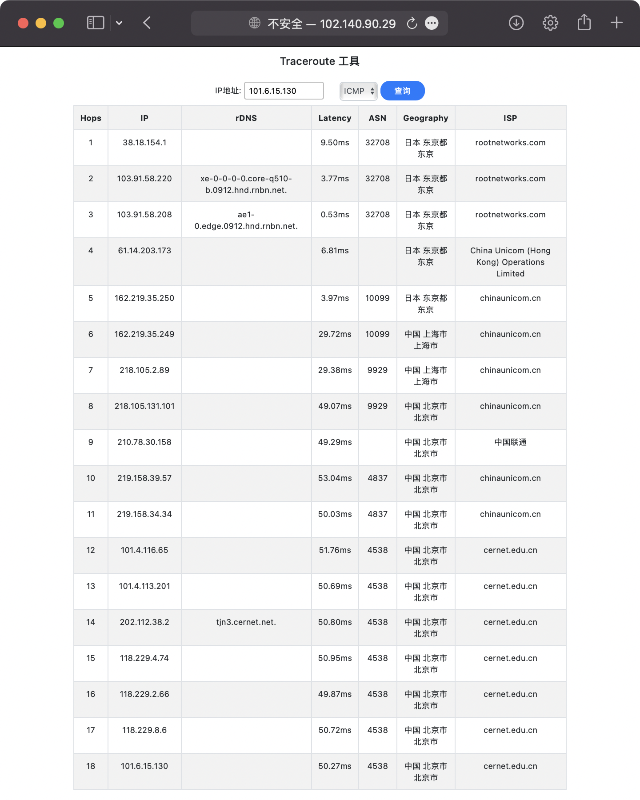
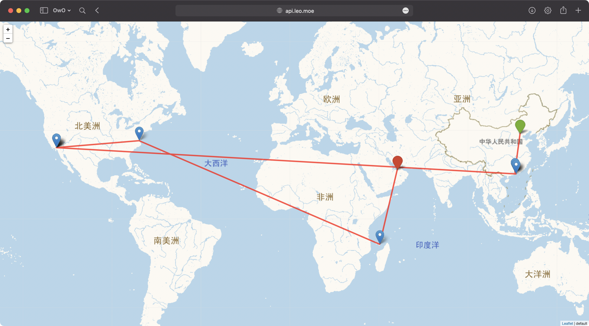

<div align="center">


</div>

# NextTrace Enhanced

一款开源的可视化路由跟踪工具，使用 Golang 开发。

NextTrace 一共有2个版本，专注于轻量的 [Lite 版本](https://github.com/xgadget-lab/nexttrace)以及更面向发烧友的 Enhanced 版本。

PS：Enhanced版本旨在提供高度可定制化的可视化 Traceroute 工具，如果需要轻量化，请使用Lite版本

## How To Use

### Automated Install

```bash
# Linux 一键安装脚本
bash <(curl -Ls https://raw.githubusercontent.com/OwO-Network/nexttrace-enhanced/main/nt_install.sh)

# GHPROXY 镜像（国内使用）
bash <(curl -Ls https://ghproxy.com/https://raw.githubusercontent.com/OwO-Network/nexttrace-enhanced/main/nt_install.sh)

# 对于macOS或一些支持brew进行包管理的可以使用此命令安装
brew tap OwO-Network/nexttrace-enhanced && brew install nexttrace
```

- `Release`里面为很多系统以及不同架构提供了编译好的二进制可执行文件，如果没有可以自行编译。
- 一些本项目的必要依赖在`Windows`上`Golang`底层实现不完全，所以目前`NextTrace`在`Windows`平台不可用。

### Get Started

`NextTrace` 默认使用`ICMP`协议发起`TraceRoute`请求，该协议同时支持`IPv4`和`IPv6`

```bash
# IPv4 ICMP Trace
nexttrace 1.0.0.1

# 报告打印（生成报告表单，并非实时，一次性输出）
nexttrace -table 1.0.0.1

# IPv6 ICMP Trace
nexttrace 2606:4700:4700::1111
```

`NextTrace` 现已支持 `Web API`，可以通过网络端进行路由跟踪测试

```bash
# 建议使用前先使用 nexttrace -c 进行API端的 Token 配置
nexttrace -w
```

`NextTrace` 现已经支持快速测试，有一次性测试回程路由需求的朋友可以使用

```bash
# 北上广（电信+联通+移动+教育网）IPv4 ICMP 快速测试
nexttrace -f

# 也可以使用 TCP SYN 而非 ICMP 进行测试
nexttrace -f -T
```

`NextTrace` 也可以使用`TCP`和`UDP`协议发起`Traceroute`请求，不过目前只支持`IPv4`

```bash
# TCP SYN Trace
nexttrace -T www.bing.com

# 可以自行指定端口[此处为443]，默认80端口
nexttrace -T -p 443 1.0.0.1

# UDP Trace
nexttrace -U 1.0.0.1

nexttrace -U -p 53 1.0.0.1
```

`NextTrace` 现已支持 `traceMap`，可以将路由显示在地图上

```bash
# 测试完成后，将返回一个查看结果的URL
nexttrace -M www.bing.com
```

`NextTrace`也同样支持一些进阶功能，如 IP 反向解析、并发数控制、模式切换等

```bash
# 每一跳发送2个探测包
nexttrace -q 2 www.hkix.net

# 无并发，每次只发送一个探测包
nexttrace -r 1 www.hkix.net

# 关闭默认开启的IP反向解析(rdns)功能
nexttrace -n www.bing.com

# 特色功能：打印Route-Path图
# Route-Path图示例：
# AS6453 塔塔通信「Singapore『Singapore』」
#  ╭╯
#  ╰AS9299 Philippine Long Distance Telephone Co.「Philippines『Metro Manila』」
#  ╭╯
#  ╰AS36776 Five9 Inc.「Philippines『Metro Manila』」
#  ╭╯
#  ╰AS37963 阿里云「ALIDNS.COM『ALIDNS.COM』」
nexttrace -report www.time.com.my
```

`NextTrace`支持用户自主选择 IP 数据库（目前支持：`LeoMoeAPI`, `IP.SB`, `IPInfo`, `IPInsight`, `IPAPI.com`）

```bash
# 可以自行指定IP数据库[此处为IP.SB]，不指定则默认为LeoMoeAPI
nexttrace -d IP.SB
## 特别的：其中 ipinfo API 需要从ipinfo自行购买服务，如有需要可以clone本项目添加其提供的token自行编译
##        TOKEN填写路径：ipgeo/tokens.go
## 另外：由于IP.SB被滥用比较严重，会经常出现无法查询的问题，请知悉。
##      IPAPI.com限制调用较为严格，如有查询不到的情况，请几分钟后再试。
```

`NextTrace`支持参数混合使用

```bash
Example:
nexttrace -d IPInsight -m 20 -p 443 -q 5 -r 20 -rdns 1.1.1.1
nexttrace -T -q 2 -r 1 -rdns -table -report 2001:4860:4860::8888
```

### IP 数据库

✨NextTrace `LeoMoeAPI` 的后端也开源啦

[GitHub - sjlleo/nexttrace-backend: NextTrace BackEnd](https://github.com/sjlleo/nexttrace-backend)

NextTrace 所有的的 IP 地理位置`API DEMO`可以参考[这里](https://github.com/xgadget-lab/nexttrace/blob/main/ipgeo/)

### 全部用法详见 Usage 菜单

```shell
Usage of nexttrace:
      'nexttrace [option...] <hostname>' or 'nexttrace <hostname> [option...]'
  -4    Only Displays IPv4 addresses
  -6    Only Displays IPv6 addresses
  -M    Print Trace Map
  -T    Use TCP SYN for tracerouting (default port is 80)
  -U    Use UDP Package for tracerouting (default port is 53 in UDP)
  -V    Check Version
  -b int
        Set the begin hop (default 1)
  -c    Manual Config [Advanced]
  -d string
        Choose IP Geograph Data Provider [LeoMoeAPI, IP.SB, IPInfo, IPInsight, IPAPI.com]
  -f    One-Key Fast Traceroute
  -fix
        Fix IP Geo Mode
  -fix-city string
        Set City/Area (For administrator use only)
  -fix-country string
        Set Country (For administrator use only)
  -fix-prov string
        Set Province/Region (For administrator use only)
  -j    Output with json format
  -m int
        Set the max number of hops (max TTL to be reached). (default 30)
  -n    Disable IP Reverse DNS lookup
  -p int
        Set SYN Traceroute Port (default 80)
  -q int
        Set the number of probes per each hop. (default 3)
  -r int
        Set ParallelRequests number. It should be 1 when there is a multi-routing. (default 18)
  -report
        Route Path
  -t int
        Set timeout [Millisecond] (default 1000)
  -table
        Output trace results as table
  -w    Enable Web API Method

```

## 项目截图

- Trace 结果示例
  

- LookingGlass 功能示例
  

- traceMap 功能示例
  

## Thanks

[Vincent Young](https://github.com/missuo) (i@yyt.moe)

[Sam Sam](https://github.com/samleong123) (samsam123@samsam123.name.my)

[tsosunchia](https://github.com/tsosunchia)

[waiting4new](https://github.com/waiting4new)

[FFEE_CO](https://github.com/fkx4-p)

## IP Database Copyright

### IPv4 Database

#### China

|      ISP       |  类型  |  数据源   | 占比 |
| :------------: | :----: | :-------: | :--: |
| 电信/联通/移动 | 骨干网 | NextTrace | 10%  |
| 电信/联通/移动 | 城域网 | 埃文科技  | 90%  |

#### WorldWide

|   ISP   |  类型  |  数据源   | 占比 |
| :-----: | :----: | :-------: | :--: |
| Tier-01 | 骨干网 |  IPInfo   |  2%  |
| Tier-01 | 骨干网 | 埃文科技  |  3%  |
| Tier-01 | 骨干网 | IPInSight |  5%  |
| Tier-01 | 城域网 | IPInSight | 90%  |

|  ISP   |  类型  |  数据源   | 占比 |
| :----: | :----: | :-------: | :--: |
| Others | 骨干网 | IPInSight |  5%  |
| Others | 城域网 | IPInSight | 95%  |

### IPv6 Database

| ISP | 类型 |      数据源      | 占比 |
| :-: | :--: | :--------------: | :--: |
| All | 全部 | IP2Location Lite | 100% |

This product includes IP2Location LITE data available from <a href="https://lite.ip2location.com">https://lite.ip2location.com</a>.

### Others

其他第三方 API 尽管集成在本项目内，但是具体的 TOS 以及 AUP，请详见第三方 API 官网。如遇到 IP 数据错误，也请直接联系他们纠错。

✨NextTrace `traceMap` 的后端也开源啦

[GitHub - tsosunchia/traceMap: NextTrace traceMap BackEnd](https://github.com/tsosunchia/traceMap)

## Star History

[](https://star-history.com/#OwO-Network/nexttrace-enhanced&xgadget-lab/nexttrace&Date)


